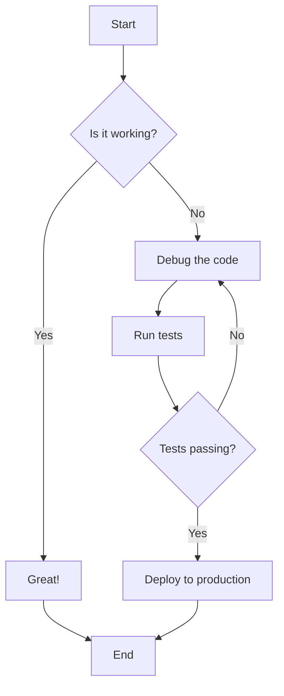
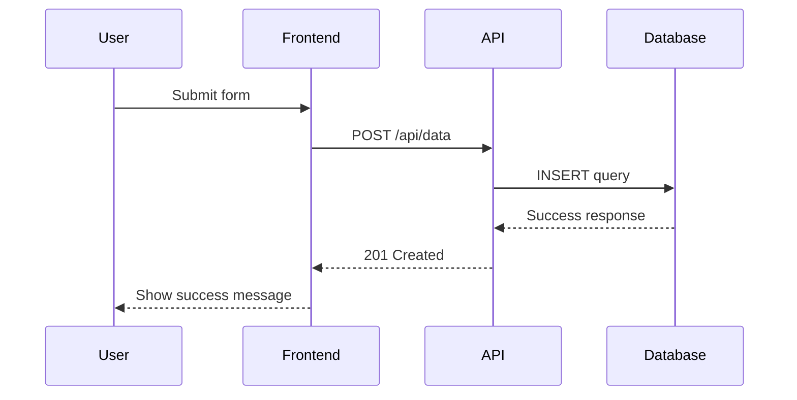
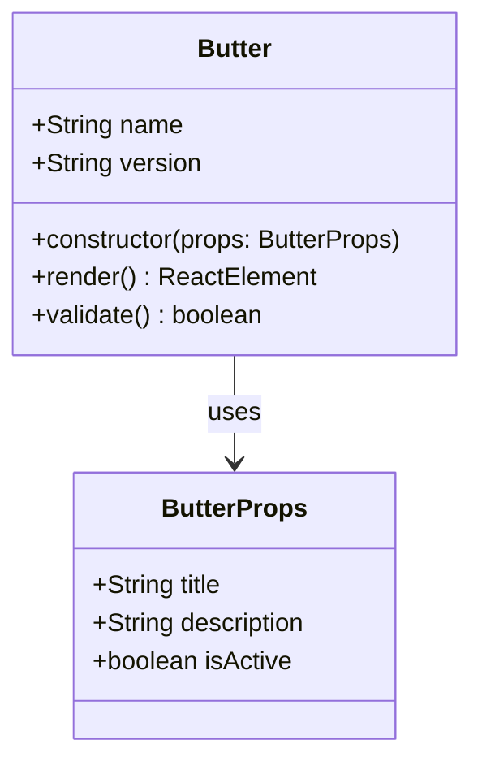
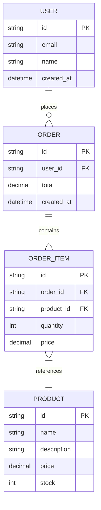
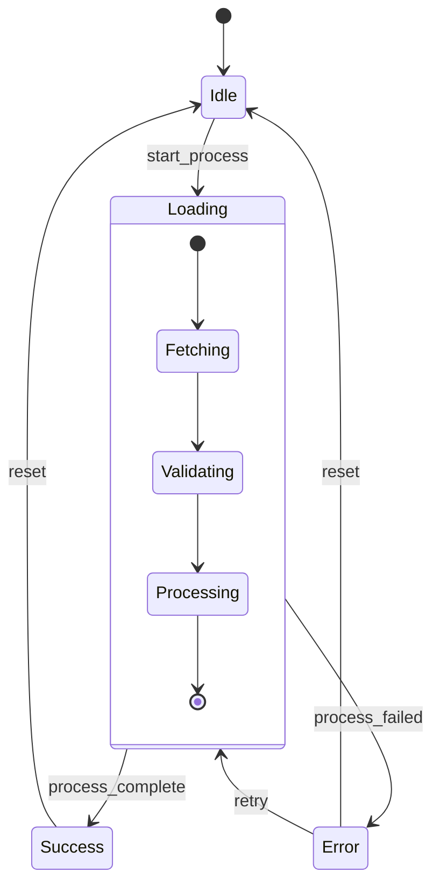
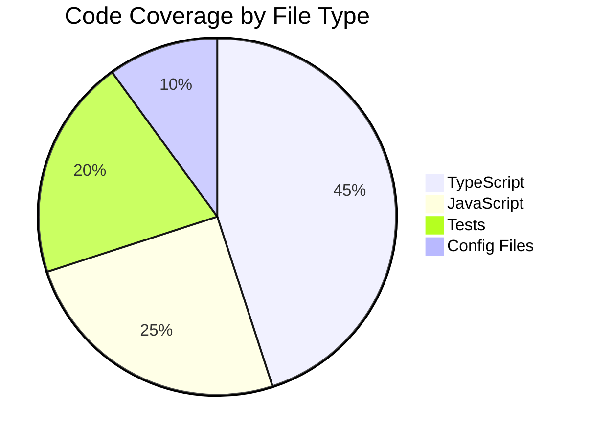
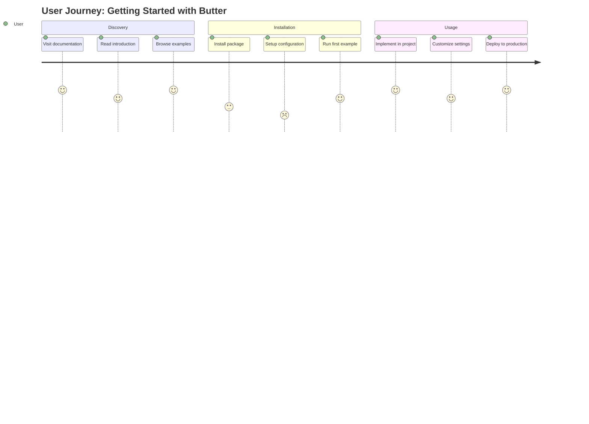
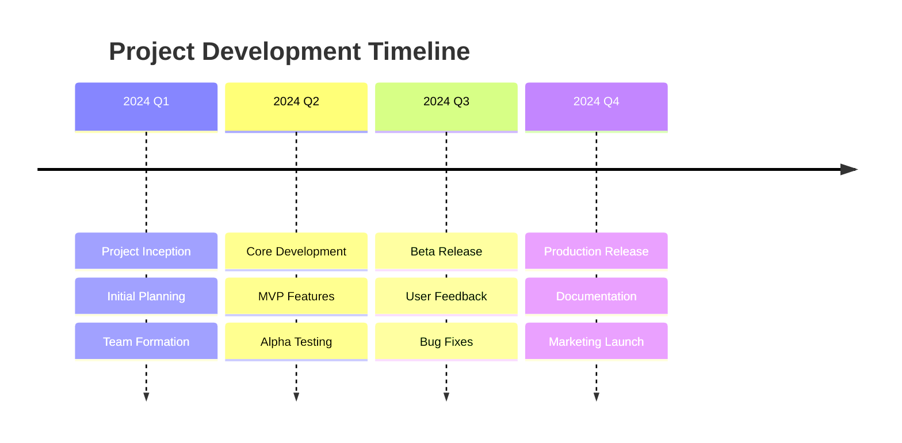

This page demonstrates the powerful diagramming capabilities available through Mermaid integration in Docusaurus.

## Flowcharts

Flowcharts are perfect for visualizing processes and decision trees:



## Sequence Diagrams

Sequence diagrams show interactions between different actors over time:



## Class Diagrams

Class diagrams illustrate the structure of your code:



## Git Flow Diagrams

Visualize your Git workflow:

```mermaid
gitgraph
    commit id: "Initial commit"
    branch develop
    checkout develop
    commit id: "Add feature A"
    commit id: "Add feature B"
    checkout main
    merge develop
    commit id: "Release v1.0"
    branch hotfix
    checkout hotfix
    commit id: "Fix critical bug"
    checkout main
    merge hotfix
    commit id: "Release v1.0.1"
```

## Entity Relationship Diagrams

Perfect for database design:



## State Diagrams

Show state transitions in your application:



## Pie Charts

Great for showing data distributions:



## User Journey Maps

Visualize user interactions:



## Timeline

Show project milestones:



These diagrams are fully interactive and will render beautifully in your documentation. Mermaid supports many more diagram types and extensive customization options.

## Next Steps

- Explore the [Mermaid documentation](https://mermaid-js.github.io/) for more diagram types
- Learn about [Docusaurus diagrams](https://docusaurus.io/docs/markdown-features/diagrams)
- Try creating your own diagrams in the documentation
